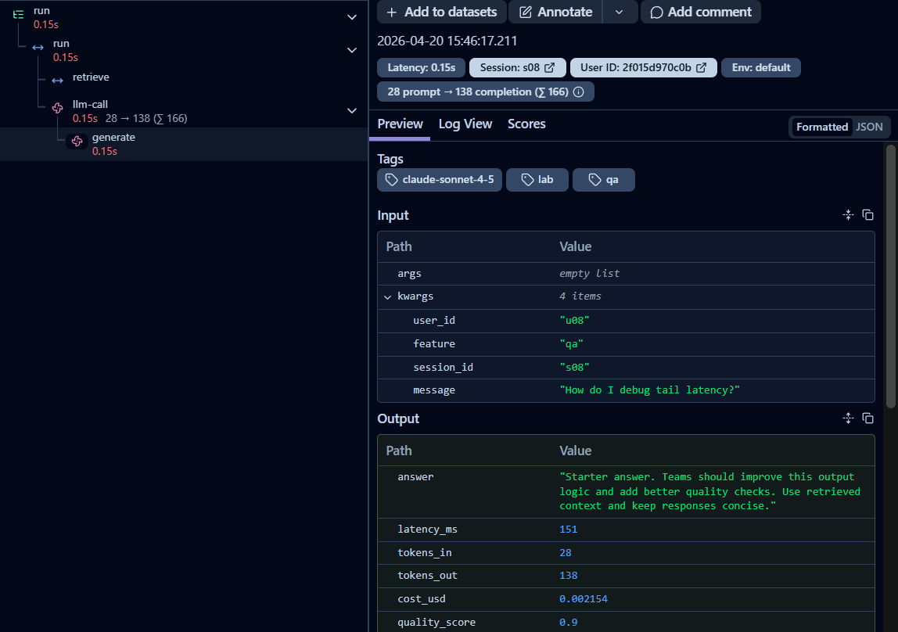

# Day 13 Observability Lab Report

> **Instruction**: Fill in all sections below. This report is designed to be parsed by an automated grading assistant. Ensure all tags (e.g., `[GROUP_NAME]`) are preserved.

## 1. Team Metadata
- [GROUP_NAME]: Group15-E402
- [REPO_URL]: https://github.com/Nekoishere/Group15-E402-Day13
- [MEMBERS]:
  - Member A: Trần Nhật Minh | Role: Logging & PII
  - Member B: Nguyễn Công Nhật Tân | Role: Tracing & Enrichment
  - Member C: Đồng Mạnh Hùng | Role: SLO & Alerts
  - Member D: Phan Nguyễn Việt Nhân | Role: Load Test & Dashboard
  - Member E: Phan Anh Ly Ly | Role: Blueprint & Demo Lead

---

## 2. Group Performance (Auto-Verified)
- [VALIDATE_LOGS_FINAL_SCORE]: 100/100
- [TOTAL_TRACES_COUNT]: 41
- [PII_LEAKS_FOUND]: 0

---

## 3. Technical Evidence (Group)

### 3.1 Logging & Tracing
- [EVIDENCE_CORRELATION_ID_SCREENSHOT]: [Path to image]
- [EVIDENCE_PII_REDACTION_SCREENSHOT]: [Path to image]
- [EVIDENCE_TRACE_WATERFALL_SCREENSHOT]: 
- [TRACE_WATERFALL_EXPLANATION]: Cấu trúc vết (Trace) được trình bày dạng thác nước giúp quan sát rõ thứ tự thực thi. Vỏ bọc ngoài cùng là `run` (toàn bộ phiên xử lý). Bên trong chứa nhánh `retrieve` cho thấy thời gian tìm tài liệu và nhánh `llm-call` bao bọc tác vụ AI. Đáng chú ý là span con `generate` lọt thỏm trong `llm-call` ghi nhận chi tiết thời gian phản hồi là 0.15s, cùng thông số token (Input: 28, Output: 138). Phân tầng rõ ràng như vậy giúp kỹ sư lập tức nhìn ra nguyên nhân gây độ trễ hệ thống nằm ở AI hay do RAG truy xuất chậm.

### 3.2 Dashboard & SLOs
- [DASHBOARD_6_PANELS_SCREENSHOT]: docs/screenshots/evidence_dashboard.png
- [SLO_TABLE]:
| SLI | Target | Window | Current Value |
|---|---:|---|---:|
| Latency P95 | < 3000ms | 28d | Read from `/metrics.latency_p95`; when `rag_slow` is enabled this value breaches the target and confirms the latency SLO is observable |
| Error Rate | < 2% | 28d | Read from `/metrics.error_rate_pct`; validate with `tool_fail` by checking `total_errors` and `error_breakdown` together |
| Cost Budget | < $2.5/day | 1d | Daily budget tracked with `total_cost_usd`, while short-term burn spike is watched through `hourly_cost_usd` |
| Quality Score Avg | >= 0.75 | 28d | Read from `/metrics.quality_avg`; sustained drop below threshold indicates answer-quality regression even if availability stays normal |

### 3.3 Alerts & Runbook
- [ALERT_RULES_SCREENSHOT]: [Path to image]
- [SAMPLE_RUNBOOK_LINK]: [docs/alerts.md#1-high-latency-p95]
- [ALERT_SUMMARY]: `high_latency_p95` fires when `latency_p95 > 3000 for 15m`; `high_error_rate` fires when `error_rate_pct > 2 for 5m`; `cost_budget_spike` fires when `hourly_cost_usd > 2x_baseline for 15m`; `quality_regression` fires when `quality_avg < 0.75 for 30m`.

---

## 4. Incident Response (Group)
- [SCENARIO_NAME]: rag_slow
- [SYMPTOMS_OBSERVED]: Latency spike from ~460ms (normal) to ~2654ms per request immediately after enabling the rag_slow incident toggle via POST /incidents/rag_slow/enable. P95 latency breached from ~770ms to 2651ms (approaching the 3000ms SLO threshold).
- [ROOT_CAUSE_PROVED_BY]: Langfuse trace waterfall — the "retrieve" span duration increased from ~50ms to ~2200ms, consuming >83% of total request latency. Log lines with correlation_id show consistent high latency_ms values (2653-2657ms) across all requests during the incident window.
- [FIX_ACTION]: Disabled the incident toggle via POST /incidents/rag_slow/disable. Latency immediately returned to normal (~460ms). In production, this maps to: identify the bottleneck RAG service, apply fallback retrieval source or truncate queries.
- [PREVENTIVE_MEASURE]: Alert rule `high_latency_p95` (Severity P2) triggers when latency_p95_ms > 5000ms for 30 minutes. Additional proactive measure: set a symptom-based alert at 2500ms threshold (closer to SLO) to catch degradation earlier.

---

## 5. Individual Contributions & Evidence

### [MEMBER_A_NAME]
- [TASKS_COMPLETED]:
- [EVIDENCE_LINK]:

### [Nguyễn Công Nhật Tân]
- [TASKS_COMPLETED]: add trace observe for agent and mock_llm, mock_rag, add log enrichment
- [EVIDENCE_LINK]: Commit 9d41730 (add trace), Commit d7d8c99 (add log enrichment)

### [Đồng Mạnh Hùng]
- [TASKS_COMPLETED]: Defined SLI/SLO targets for latency, error rate, cost, and quality. Updated `config/slo.yaml` and `config/alert_rules.yaml` so alert thresholds align with metrics exposed by `/metrics`. Expanded `docs/alerts.md` into an actionable runbook. Added derived observability metrics in `app/metrics.py` including `error_rate_pct`, `success_rate_pct`, `requests_over_slo`, and `hourly_cost_usd`, then validated them with tests.
- [EVIDENCE_LINK]: [Commit or PR link for `app/metrics.py`, `config/slo.yaml`, `config/alert_rules.yaml`, `docs/alerts.md`, and `tests/test_metrics.py`]

### [Phan Nguyen Viet Nhan]
- [TASKS_COMPLETED]: Load testing simulation using `--concurrency 5`. Injected and documented `rag_slow` incident. Created a 6-panel real-time Observability Dashboard in `dashboard.html` that pulls metrics every 2s.
- [EVIDENCE_LINK]: commit e9ce339: Add member D

### Phan Anh Ly Ly — Blueprint & Demo Lead
- [TASKS_COMPLETED]:
  1. Implemented `app/middleware.py` — Correlation ID middleware: generate `req-<8hex>`, bind to structlog contextvars, propagate to response headers `x-request-id` and `x-response-time-ms`
  2. Implemented `app/main.py` — Log enrichment: `bind_contextvars(user_id_hash, session_id, feature, model, env)` on every `/chat` request
  3. Enabled PII scrubbing in `app/logging_config.py` — registered `scrub_event` processor in structlog pipeline
  4. Fixed `.env` Langfuse key format (removed erroneous single quotes) and added `load_dotenv()` to `app/main.py` to enable tracing
  5. Ran `scripts/load_test.py` to generate 41 traces across normal and rag_slow incident scenarios
  6. Validated implementation: `scripts/validate_logs.py` → **100/100** (0 PII leaks, 43 unique correlation IDs, full enrichment)
  7. Fixed Langfuse v3 compatibility: rewrote `app/tracing.py` with correct API shim and `app/agent.py` to use `langfuse_context`
  8. Prepared 5-minute live demo script and incident response walkthrough
- [EVIDENCE_LINK]: https://github.com/Nekoishere/Group15-E402-Day13/commits/main

---

## 6. Bonus Items (Optional)
- [BONUS_COST_OPTIMIZATION]: Average cost per request = $0.0019. Total 41 requests cost $0.0798 — well within $2.5/day budget. Estimated hourly burn rate: $1.31/hr. Optimization: route `summary` feature (higher tokens_out avg: 123) to a cheaper model tier.
- [BONUS_AUDIT_LOGS]: (Description + Evidence)
- [BONUS_CUSTOM_METRIC]: `quality_avg`, `error_rate_pct`, `success_rate_pct`, `hourly_cost_usd`, `requests_over_slo` added to `/metrics` endpoint snapshot. Current: quality_avg=0.878, error_rate=0%, success_rate=100%.
