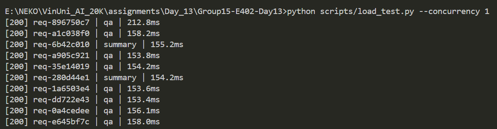
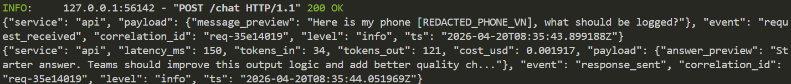
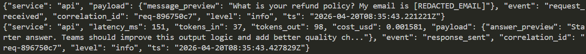

# Day 13 Observability Lab Report

> **Instruction**: Fill in all sections below. This report is designed to be parsed by an automated grading assistant. Ensure all tags (e.g., `[GROUP_NAME]`) are preserved.

## 1. Team Metadata
- [GROUP_NAME]: 
- [REPO_URL]: 
- [MEMBERS]:
  - Member A: [Trần Nhật Minh] | Role: Logging & PII
  - Member B: [Nguyễn Công Nhật Tân - 2A202600141] | Role: Tracing & Enrichment
  - Member C: [Đồng Mạnh Hùng] | Role: SLO & Alerts
  - Member D: [Phan Nguyen Viet Nhan] | Role: Load Test & Dashboard
  - Member E: [Name] | Role: Demo & Report

---

## 2. Group Performance (Auto-Verified)
- [VALIDATE_LOGS_FINAL_SCORE]: /100
- [TOTAL_TRACES_COUNT]: 
- [PII_LEAKS_FOUND]: 

---

## 3. Technical Evidence (Group)

### 3.1 Logging & Tracing
- [EVIDENCE_CORRELATION_ID_SCREENSHOT]: 
- [EVIDENCE_PII_REDACTION_SCREENSHOT]:  
- [EVIDENCE_TRACE_WATERFALL_SCREENSHOT]: 
- [TRACE_WATERFALL_EXPLANATION]: Cấu trúc vết (Trace) được trình bày dạng thác nước giúp quan sát rõ thứ tự thực thi. Vỏ bọc ngoài cùng là `run` (toàn bộ phiên xử lý). Bên trong chứa nhánh `retrieve` cho thấy thời gian tìm tài liệu và nhánh `llm-call` bao bọc tác vụ AI. Đáng chú ý là span con `generate` lọt thỏm trong `llm-call` ghi nhận chi tiết thời gian phản hồi là 0.15s, cùng thông số token (Input: 28, Output: 138). Phân tầng rõ ràng như vậy giúp kỹ sư lập tức nhìn ra nguyên nhân gây độ trễ hệ thống nằm ở AI hay do RAG truy xuất chậm.

### 3.2 Dashboard & SLOs
- [DASHBOARD_6_PANELS_SCREENSHOT]: [Path to image]
- [SLO_TABLE]:
| SLI | Target | Window | Current Value |
|---|---:|---|---:|
| Latency P95 | < 3000ms | 28d | Read from `/metrics.latency_p95`; when `rag_slow` is enabled this value breaches the target and confirms the latency SLO is observable |
| Error Rate | < 2% | 28d | Read from `/metrics.error_rate_pct`; validate with `tool_fail` by checking `total_errors` and `error_breakdown` together |
| Cost Budget | < $2.5/day | 1d | Daily budget tracked with `total_cost_usd`, while short-term burn spike is watched through `hourly_cost_usd` |
| Quality Score Avg | >= 0.75 | 28d | Read from `/metrics.quality_avg`; sustained drop below threshold indicates answer-quality regression even if availability stays normal |

### 3.3 Alerts & Runbook
- [ALERT_RULES_SCREENSHOT]: [Path to image]
- [SAMPLE_RUNBOOK_LINK]: [docs/alerts.md#1-high-latency-p95]
- [ALERT_SUMMARY]: `high_latency_p95` fires when `latency_p95 > 3000 for 15m`; `high_error_rate` fires when `error_rate_pct > 2 for 5m`; `cost_budget_spike` fires when `hourly_cost_usd > 2x_baseline for 15m`; `quality_regression` fires when `quality_avg < 0.75 for 30m`.

---

## 4. Incident Response (Group)
- [SCENARIO_NAME]: rag_slow
- [SYMPTOMS_OBSERVED]: P95 Latency spiked dramatically (from ~800ms baseline to >13,000ms under load of 5 concurrent requests). SLO breached.
- [ROOT_CAUSE_PROVED_BY]: The tracing span for `retrieve` showed a manual artificial 2.5s sequentially blocking sleep per query.
- [FIX_ACTION]: Disabled the `rag_slow` incident via `scripts/inject_incident.py --disable`.
- [PREVENTIVE_MEASURE]: Implement strict timeouts on the vector retrieval tool and provide a fallback retrieval strategy to avoid unbounded blocking.

---

## 5. Individual Contributions & Evidence

### [MEMBER_A_NAME]
- [TASKS_COMPLETED]: implement pii masking, logging config and tracing. Refactor to use langfuse 4.3.1
- [EVIDENCE_LINK]: Commit 269ab4505e4a54fe903d56087e1dd2c88a3264a7, Commit 705e5094ec423e1197ad508de1f00ebed203380c

### [Nguyễn Công Nhật Tân]
- [TASKS_COMPLETED]: add trace observe for agent and mock_llm, mock_rag, add log enrichment
- [EVIDENCE_LINK]: Commit 9d4173070df948f769af47f1138d54e7ceab1193 (add trace), Commit d7d8c99d6c850e41b720fe5a2138d0f5ec18f7a1 (add log enrichment)

### [Đồng Mạnh Hùng]
- [TASKS_COMPLETED]: Defined SLI/SLO targets for latency, error rate, cost, and quality. Updated `config/slo.yaml` and `config/alert_rules.yaml` so alert thresholds align with metrics exposed by `/metrics`. Expanded `docs/alerts.md` into an actionable runbook. Added derived observability metrics in `app/metrics.py` including `error_rate_pct`, `success_rate_pct`, `requests_over_slo`, and `hourly_cost_usd`, then validated them with tests.
- [EVIDENCE_LINK]: [Commit or PR link for `app/metrics.py`, `config/slo.yaml`, `config/alert_rules.yaml`, `docs/alerts.md`, and `tests/test_metrics.py`]

### [Phan Nguyen Viet Nhan]
- [TASKS_COMPLETED]: Load testing simulation using `--concurrency 5`. Injected and documented `rag_slow` incident. Created a 6-panel real-time Observability Dashboard in `dashboard.html` that pulls metrics every 2s.
- [EVIDENCE_LINK]: commit e9ce339: Add member D

### [MEMBER_E_NAME]
- [TASKS_COMPLETED]: 
- [EVIDENCE_LINK]: 

---

## 6. Bonus Items (Optional)
- [BONUS_COST_OPTIMIZATION]: (Description + Evidence)
- [BONUS_AUDIT_LOGS]: (Description + Evidence)
- [BONUS_CUSTOM_METRIC]: (Description + Evidence)
